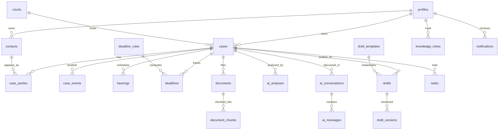

# 04 — Database Design

PostgreSQL 15+ on Supabase. Extensions: `pgcrypto` (UUIDs), `vector` (pgvector, embeddings). Canonical DDL lives in `supabase/migrations/` — this doc explains the model; the SQL is authoritative.

## Design principles

1. **Single-owner rows, firm-ready.** Every user table carries `owner_id uuid` → `auth.users`. RLS = `owner_id = auth.uid()` everywhere. Future firm tier adds a `firm_members` table and swaps policies — no data migration of user tables required.
2. **Gregorian UTC in the database, Jalali only at the edge.** All dates are `timestamptz`/`date` in Gregorian. Jalali conversion happens exclusively in `src/lib/jalali.ts`. Deadline arithmetic is done in Gregorian (Iranian statutory periods are day/month counts; month-based periods use Jalali month arithmetic at the domain layer — see doc 10 §Deadlines).
3. **Global reference tables are seed-owned.** `deadline_rules`, `legal_articles`, `draft_templates`, and the national `courts` list have no owner and are read-only to clients (`owner_id IS NULL` rows readable by all authenticated users; user-created courts coexist with `owner_id` set).
4. **Append-only timeline.** `case_events` is the audit spine of a case; every module (hearings, deadlines, documents, AI, drafts) writes an event. AI agents read it as case memory.
5. **Text + CHECK over enums.** State machines (`cases.stage`, `deadlines.status`) use `text` with CHECK constraints; growable taxonomies (document types, tags) are unconstrained text/text[] validated in the domain layer (`src/lib/domain/`).
6. **Embeddings live next to rows.** `vector(1536)` (OpenAI `text-embedding-3-small`) on `document_chunks`, `knowledge_notes`, `legal_articles` with HNSW cosine indexes; similarity exposed via SQL functions so the client never composes vector SQL.

## Entity-relationship overview



## Tables

### Identity & CRM

**`profiles`** — 1:1 with `auth.users` (created by trigger on signup). `full_name`, `bar_license_no`, `bar_type` (`kanoon`|`markaz`), `phone`, `firm_name`, `city`, `settings jsonb` (UI prefs, reminder offsets).

**`contacts`** — the CRM. `kind`: `client` | `opponent` | `opposing_counsel` | `judge` | `expert` | `other`. `person_type`: `natural` | `legal`. Fields: `full_name`, `national_id` (کد ملی / شناسه ملی — used by conflict check), `phone`, `email`, `city`, `address`, `notes`. Judges accumulate intel via `knowledge_notes.judge_contact_id`.

**`courts`** — `name`, `kind` (`civil`|`criminal_1`|`criminal_2`|`family`|`appeal`|`supreme`|`admin_justice`|`dispute_council`|`prosecutor`|`revolutionary`|`enforcement`), `province`, `city`. Seed rows have `owner_id NULL`; users may add their own.

### Litigation core

**`cases`** — `archive_no` (internal شماره بایگانی), `case_no` (court 16-digit شماره پرونده), `title`, `case_type` (`civil`|`property`|`criminal`|`family`|`commercial`|`administrative`), `stage` (`pre_filing`|`first_instance`|`vakhahi`|`appeal`|`cassation`|`enforcement`|`closed` — CHECK), `client_position` (`plaintiff`|`defendant`|`complainant`|`accused`|`appellant`|`respondent`|`third_party`), `subject` (خواسته/اتهام), `claim_value bigint` (Rials, بهای خواسته), `court_id`, `court_branch`, `judge_name`, `status` (`active`|`won`|`lost`|`settled`|`suspended`|`closed`), `filed_at date`, `description`, `ai_summary` (kept fresh by Case Analyzer), timestamps.

**`case_parties`** — `case_id`, `contact_id`, `role` (`client`|`opponent`|`opposing_counsel`|`co_counsel`|`third_party`), `note`. Conflict check = lookup of new opposing party's `national_id`/name against own `contacts.kind='client'`.

**`case_events`** — append-only. `event_type` (`filing`|`hearing`|`ruling`|`service`|`submission`|`status_change`|`document`|`deadline`|`ai_analysis`|`note`|`draft`), `title`, `description`, `event_date timestamptz`, `metadata jsonb`. Indexed `(case_id, event_date desc)`.

### Time: hearings, deadlines, tasks

**`hearings`** — `case_id`, `hearing_at timestamptz`, `kind` (`trial`|`investigation`|`expert_review`|`mediation`|`other`), `location`, `notes`, `result`, `status` (`upcoming`|`held`|`postponed`|`cancelled`).

**`deadline_rules`** *(global seed)* — the encoded مواعد of Iranian procedure. `code` (e.g. `appeal_civil`), `title_fa` (تجدیدنظرخواهی حقوقی), `citation` (ماده ۳۳۶ ق.آ.د.م), `days_inside`, `days_abroad`, `months_inside`, `months_abroad` (rules are day-based **or** month-based), `category` (`civil`|`criminal`|`admin`|`registration`), `description_fa`. Full rule list in doc 10.

**`deadlines`** — `case_id`, `title`, `rule_code` (nullable → manual deadline), `citation` (denormalized so it survives rule edits), `trigger_date date` (usually تاریخ ابلاغ), `is_abroad bool`, `due_at date`, `status` (`open`|`done`|`missed`|`cancelled`), `priority` (`critical`|`high`|`normal`), `notes`, `created_by` (`user`|`agent`). The **server** computes `due_at` from rule+trigger (single implementation in `src/lib/domain/deadlines.ts`); clients never do date math.

**`tasks`** — lightweight todos: `title`, `case_id?`, `due_on date?`, `status`, `priority`.

**`notifications`** — in-app: `kind` (`deadline_upcoming`|`hearing_upcoming`|`document_ready`|`agent_done`|`system`), `title`, `body`, `link`, `read_at`.

### Documents & vectors

**`documents`** — `case_id?`, `title`, `doc_type` (`petition`|`brief`|`ruling`|`service_notice`|`contract`|`poa`|`evidence`|`expert_opinion`|`correspondence`|`other`), `storage_path` (bucket `documents`, key `{owner_id}/{uuid}/{filename}`), `mime_type`, `size_bytes`, `pages`, `extracted_text`, `ai_summary`, `tags text[]`, `status` (`pending`|`processing`|`ready`|`failed`), `processed_at`.

**`document_chunks`** — `document_id`, `case_id` (denormalized for filtered search), `seq`, `content` (~1,200 chars, 200 overlap, paragraph-aware Persian chunker), `embedding vector(1536)`. HNSW index `vector_cosine_ops`.

### AI

**`ai_conversations`** — `case_id?`, `agent` (orchestrator or specialist code), `title`. **`ai_messages`** — `role` (`user`|`assistant`), `content`, `agent` (which specialist answered), `citations jsonb` `[ {kind: 'article'|'document'|'note', id, label, locator} ]`, `tool_calls jsonb`, token counts.

**`ai_analyses`** — persisted structured outputs. `kind` (`case_analysis`|`contract_review`|`strategy`|`evidence_review`|`hearing_prep`|`document_summary`|`property_analysis`), `agent`, `title`, `content_md`, `structured jsonb` — canonical shape:
```json
{ "risks": [{"title","detail","severity":"high|medium|low","citation"}],
  "weaknesses": [...], "opportunities": [...],
  "missing_evidence": [...], "suggested_articles": [{"law","article","why"}],
  "next_steps": [...] }
```

### Drafting & knowledge

**`draft_templates`** *(global seed)* — `code` (`petition_civil`, `defense_brief`, `appeal_brief`, `criminal_complaint`, `formal_notice`, `contract_generic`, …), `title_fa`, `doc_kind`, `skeleton_md` (structure the Drafting Agent must follow), `required_fields jsonb`.

**`drafts`** — `case_id?`, `template_code?`, `title`, `doc_kind`, `content_md`, `status` (`draft`|`final`), `version`. **`draft_versions`** keeps history on every explicit save.

**`knowledge_notes`** — the vault. `kind` (`experience`|`argument`|`precedent`|`note`|`snippet`), `title`, `content_md`, `tags text[]`, `case_id?`, `judge_contact_id?`, `outcome` (`won`|`lost`|`pending`|`na`), `embedding vector(1536)`.

**`legal_articles`** *(global seed)* — curated Iranian legal corpus for RAG. `kind` (`article`|`unification_ruling`), `law_code` (`civil_code`|`civil_procedure`|`criminal_procedure`|`islamic_penal`|`commerce`|`cheque_law`|`landlord_tenant_56`|`landlord_tenant_76`|`family_protection`|`admin_justice`|`enforcement_civil`|`constitution`…), `law_title_fa`, `article_no`, `text_fa`, `topic_tags text[]`, `embedding vector(1536)`. Seeded ≈100 highest-leverage provisions (doc 10 lists them); expandable corpus is an M1+ data task.

## Search functions (SECURITY INVOKER — RLS applies)

```sql
match_document_chunks(query_embedding vector, match_count int, p_case_id uuid default null)
match_knowledge_notes(query_embedding vector, match_count int)
match_legal_articles(query_embedding vector, match_count int, p_law_code text default null)
```
Each returns rows + `similarity` (1 − cosine distance). Keyword fallback: `ILIKE`/trigram on `extracted_text`, `content_md`, `text_fa` (Persian FTS uses the `simple` config; stemming Persian is out of MVP scope).

## RLS summary

| Table group | SELECT | INSERT/UPDATE/DELETE |
|---|---|---|
| All user tables | `owner_id = auth.uid()` | same, `WITH CHECK (owner_id = auth.uid())` |
| `courts` | own rows **or** `owner_id IS NULL` | own rows only |
| `deadline_rules`, `legal_articles`, `draft_templates` | any authenticated | none (service role only) |
| `profiles` | own row | own row (insert via signup trigger) |
| Storage `documents` bucket | path prefix = `auth.uid()` | same |

Indexes beyond PKs: every FK; `(owner_id, status)` on cases/deadlines/tasks; `(case_id, event_date desc)` on events; `(owner_id, due_at)` on deadlines; `(owner_id, hearing_at)` on hearings; GIN on `tags`; HNSW on the three vector columns.
